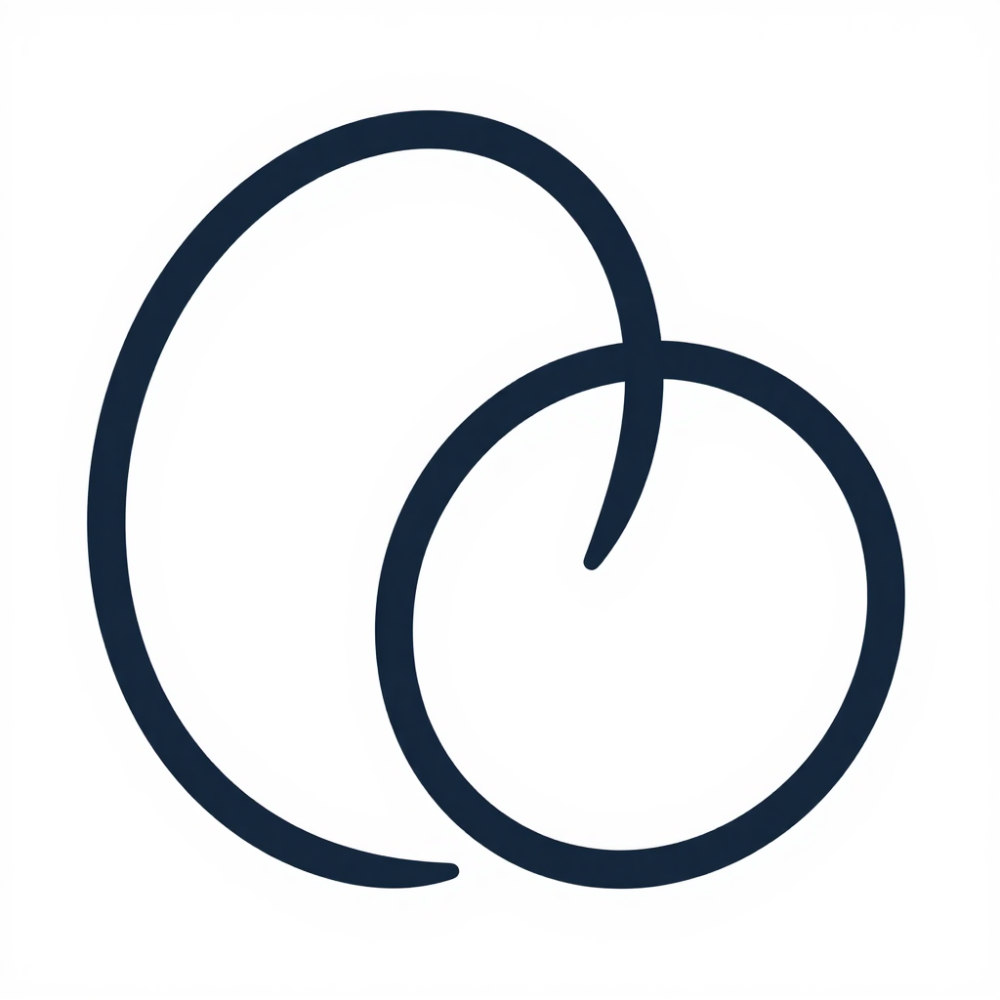

<div align="center">
  
  <h2>ProxyArea</h2>
  <h3>轻量通用 HTTP 代理转发器</h3>
</div>

通用 HTTP 代理转发器，将任意 HTTP 请求透明转发到目标服务，支持密钥认证、HTTPS 监听、目标主机白名单与上游超时。

纯 Go 标准库实现，零外部依赖，免 CGO，单文件二进制 < 7MB。

### 一、仓库

- GitHub: https://github.com/FasterEdge/ProxyArea

### 二、启动

```bash
ProxyArea --addr=:8080 --key=my_secret
# 或前台调试
ProxyArea --addr=:8080 --allow-hosts=127.0.0.1,api.internal
```

#### 参数

| 参数 | 类型 | 默认值 | 说明 |
|---|---|---|---|
| `--addr` | string | `:8080` | 监听地址 |
| `--key` | string | `""` | 访问密钥，留空则不验证 |
| `--https` | bool | `false` | 本服务是否启用 HTTPS |
| `--cert_file` | string | `""` | HTTPS 证书文件路径 |
| `--key_file` | string | `""` | HTTPS 证书私钥文件路径 |
| `--timeout` | duration | `30s` | 上游请求超时 |
| `--target-scheme` | string | `http` | 目标 URL 未带协议时的默认协议 |
| `--allow-hosts` | string | `""` | 目标主机白名单（逗号分隔），空表示不限制 |
| `--insecure-skip-verify` | bool | `false` | 跳过自签名 HTTPS 目标证书校验 |

### 三、接口

所有接口都接受 query 参数 `url`（必填）、`key`、`params`、`https` 与 `https=true` 标记。`/post` 与 `/proxy` 还会原样转发请求 body。

| 接口 | 方法 | 转发目标 |
|---|---|---|
| `GET /` | GET | 返回服务版本（健康检查） |
| `GET /get` | GET | 转发为 GET |
| `POST /post` | POST | 转发为 POST |
| `Any /proxy` | 任意 | 转发为同方法 |
| `Any /proxy/...` | 任意 | 转发为同方法 |

#### 转发参数

| 字段 | 来源 | 说明 |
|---|---|---|
| `url` | query / form | **必填**。目标 URL。省略协议时使用 `https` 参数或 `--target-scheme` |
| `key` | query / form | 与 `--key` 启动参数匹配 |
| `params` | query / form | 可选。追加到目标 URL 的 query，支持 URL 编码 |
| `https` | query / form | `true` 时目标 URL 使用 `https://` |
| body | 请求体 | POST/PUT/PATCH/DELETE 时原样转发到目标 |

#### 行为细节

- 请求头除 `Connection` `Keep-Alive` `Host` `Content-Length` 等跳变头外全部转发
- 默认 `User-Agent` 为 `ProxyArea/1.0.20260826`
- 响应头原样回传（除跳变头外）
- 目标主机若不在 `--allow-hosts` 白名单则返回 403

### 四、安全

- 未配置 `--key` 时不验证密钥（开发模式，**生产环境必须配置**）
- `--allow-hosts` 为空时**任意目标 URL 都可访问**（包括内网，存在 SSRF 风险）
- 部署在公网时务必同时设置 `--key` 与 `--allow-hosts`
- HTTPS 监听需自备证书，可通过 `--insecure-skip-verify` 跳过上游证书校验

### 五、与 FasterEdge 生态配合

#### 通过 DontCrack 进程管理器托管

```bash
DontCrack \
  -path /usr/local/bin/ProxyArea \
  -args "--addr=:8080 --key=my_secret" \
  -start-now -auto-restart -max-retries 3 \
  -port 11884 \
  -probe-cmd "wget -q --spider http://127.0.0.1:8080/ || exit 1" \
  -file-log
```

这样可获得自动重启、健康探针、`/healthz` `/metrics` Prometheus 端点。

#### 通过 Docker

```bash
docker build -t proxyarea .
docker run -d --name proxyarea -p 8080:8080 proxyarea --key=my_secret
```

多阶段构建会自动为目标平台（amd64 / arm64）生成静态二进制。

### 六、跨平台预编译二进制

仓库根目录提供三个平台预编译产物，文件名含版本号与目标：

| 文件 | 平台 |
|---|---|
| `ProxyArea_1.0.20260826_linux_amd64` | Linux x86-64 |
| `ProxyArea_1.0.20260826_linux_arm64` | Linux ARM64 |
| `ProxyArea_1.0.20260826_windows_amd64.exe` | Windows x86-64 |

### 七、自行构建

```bash
go build -o proxyarea .

# 交叉编译
CGO_ENABLED=0 GOOS=linux GOARCH=arm64 go build -o proxyarea-linux-arm64 .
CGO_ENABLED=0 GOOS=windows GOARCH=amd64 go build -o proxyarea.exe .
```

### 八、测试

`test_usage.md` 含完整测试用例与配套测试服务器描述。简要示例：

```bash
# 起一个上游
python3 -m http.server 8081 &

# 起 ProxyArea
ProxyArea --addr=:8080 --key=my_secret --allow-hosts=127.0.0.1 &

# 转发 GET
curl "http://127.0.0.1:8080/get?url=http://127.0.0.1:8081/&key=my_secret"

# 转发 POST（body 原样转发）
curl -X POST "http://127.0.0.1:8080/post?url=http://127.0.0.1:8081/&key=my_secret" \
  -H "Content-Type: application/json" \
  -d '{"hello":"world"}'

# 通用 /proxy（转发请求自身的方法）
curl -X DELETE "http://127.0.0.1:8080/proxy?url=http://127.0.0.1:8081/&key=my_secret"
```

### 九、变更日志

#### 1.0.20260826

- **从 gin 迁移到 Go 标准库 `net/http`**，无任何第三方依赖，编译产物从 ~22MB 降至 ~6MB
- 新增 `--allow-hosts` 目标主机白名单（修复 SSRF 默认无防护问题）
- 新增 `--timeout` 上游超时
- 新增 `--insecure-skip-verify` 自签名 HTTPS 跳过证书校验
- 新增 `--addr` `--target-scheme` 启动参数
- 新增 `/proxy` `/proxy/` 通用代理接口（任意方法）
- 修复 POST body 转发问题（原版对 form 表单 POST 后 body 已被 gin 消费，导致转发 body 为空）
- 修复 `arm64` 预编译二进制实为 `x86-64` 的混淆
- 修复文件名 `windos` 拼写（向后兼容保留旧名）
- 修复 `panic` → `log.Fatal` 在启动时缺证书的场景

#### 1.0.0

- 初版（gin 实现）
